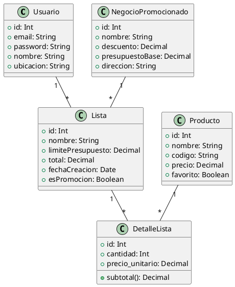

# Arquitectura General

## 1. Diagrama de Clases (PlantUML)



## 2. Modelo Entidad–Relación (texto)
- Usuario 1..* Lista
- Lista 1..* DetalleLista
- Producto M..N Lista (a través de DetalleLista)
- NegocioPromocionado 1..* Lista

## 3. Flujo de Navegación Android
```
Splash -> (token?) -> Login -> Home (BottomNav)
   Home.tabs:
     - ListaFragment -> DetalleLista
     - PromocionesFragment
     - PerfilFragment
```
